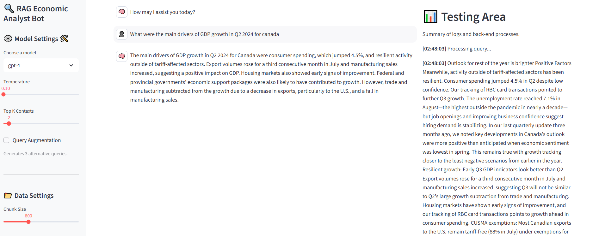

📝 Project Overview and Features
This project consists of a Retrieval-Augmented Generation chatbot build with LangChain and Streamlit for 
interactive experiementation. It performs retrieval of local PDFs stored in a Chroma vector database
and integrates live economic data source from the FRED API, allowing for a hybrid retrieval data workflow.

🚀 Features

🔍 Retrieval-Augmented Generation

Uses Chroma as the vector database to index and retrieve text from locally stored economic reports (PDFs).

The FRED API is called when a LLM assistant determines external data is required to answer user's query. LLM can dynamically build the request to the API, ensuring only the required economic data is requested.

🧮 Interactive UI - The UI allows for a experimental usage to understand how parameters affect the system output.

Switch between different LLM models.

Adjust temperature and top_k chunks retrieved.

Re-run local embeddings with a different chunk and overlap size.

View back-end logs directly from the testing area.

🎛️ Query Augmentation

Optional query rewriting feature that generates three semantically similar queries to improve retrieval quality.

